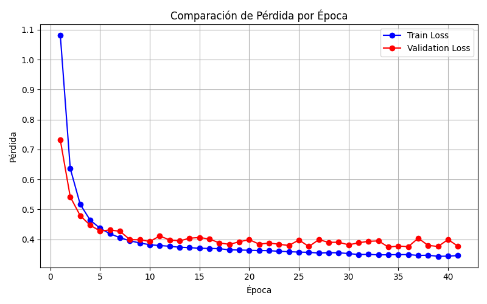

# Fashion-PyTorch

En este ejercicio resolveremos el dataset *Fashion* (ejercicio que ya resolvimos en el pasado) utilizando la libreria **PyTorch**, libreria que planeamos utilizar los proximos meses.

Se utilizara una arquitectura tipo MLP.

Luego, buscaremos implementar conceptos relacionados con la implementacion avanzada de una red neuronal, vease Normalization, Weigths Initialization (He Initialization), Advanced Activation Functions, LR Scheduling, etc.


# Preprocesamiento

## Visualizacion del dataset

Primeramente, utilizando el siguiente codigo cargamos el conjunto de datos y revisamos el shape 

```python

import torch
from torchvision import datasets, transforms
import numpy as np

train_dataset = datasets.FashionMNIST(
    root='./data',
    train=True,
    download=True,
)

# Cargar el dataset de prueba
test_dataset = datasets.FashionMNIST(
    root='./data',
    train=False,
    download=True,
)

print(train_dataset)
print(test_dataset)
```

Resultado:

```
Dataset FashionMNIST
    Number of datapoints: 60000
    Root location: ./data
    Split: Train
Dataset FashionMNIST
    Number of datapoints: 10000
    Root location: ./data
    Split: Test
```

La variable *train_dataset* y *test_dataset* contienen 60.000 y 10.000 tuplas respectivamente con pares (imagen, tag), debemos crear una funcion para convertir las imagenes en su representacion matricial.

Luego, creamos la siguiente funcion para convertir los datasets:

```python
import numpy as np
import torch
def convert_dataset(set_):
    X_data = []
    Y_data = []
    print('Convirtiendo imagenes')
    for (img, tag) in set_:
        X_data.append(np.array(img))
        Y_data.append(tag)
    return torch.tensor(np.array(X_data)), torch.tensor(np.array(Y_data)).unsqueeze(1)
```

Y usando el siguiente codigo:

```python
from torchvision import datasets
from utils.convert_dataset import convert_dataset

train_dataset = datasets.FashionMNIST(
    root='./data',
    train=True,
    download=True,
)

# Cargar el dataset de prueba
test_dataset = datasets.FashionMNIST(
    root='./data',
    train=False,
    download=True,
)

X_train,Y_train = convert_dataset(train_dataset)
X_test,Y_test = convert_dataset(test_dataset)

print("Shape del x-train")
print(X_train.shape)
print("Shape del y-train")
print(Y_train.shape)

print("Shape del x-test")
print(X_test.shape)
print("Shape del y-test")
print(Y_test.shape)
```

Resultado:

```
Shape del x-train
torch.Size([60000, 28, 28])
Shape del y-train
torch.Size([60000, 1])
Shape del x-test
torch.Size([10000, 28, 28])
Shape del y-test
torch.Size([10000, 1])
```

Conclusion: cada imagen esta representada por una matriz de 28x28, tenemos 60.000 de esas matrices en el conjunto de train y 10.000 en el de test.

Cada imagen tiene la siguiente forma:

```
[  0,   0,   0,   0,   0,   0,   0,   0,   0,   0,   0,   0,   0,   0,
           0,   0,   0,   0,   0,   0,   0,   0,   0,   0,   0,   0,   0,   0],
        [  0,   0,   0,   0,   0,   0,   0,   0,   0,   0,   0,   0,   0,   0,
           0,   0,   0,   0,   0,   0,   0,   0,   0,   0,   0,   0,   0,   0],
        [  0,   0,   0,   0,   0,   0,   0,   0,   0,   0,   0,   0,   0,   0,
           0,   0,   0,   0,   0,   0,   0,   0,   0,   0,   0,   0,   0,   0],
        [  0,   0,   0,   0,   0,   0,   0,   0,   0,   0,   0,   0,   1,   0,
           0,  13,  73,   0,   0,   1,   4,   0,   0,   0,   0,   1,   1,   0],
        [  0,   0,   0,   0,   0,   0,   0,   0,   0,   0,   0,   0,   3,   0,
          36, 136, 127,  62,  54,   0,   0,   0,   1,   3,   4,   0,   0,   3],
        [  0,   0,   0,   0,   0,   0,   0,   0,   0,   0,   0,   0,   6,   0,
         102, 204, 176, 134, 144, 123,  23,   0,   0,   0,   0,  12,  10,   0],
        [  0,   0,   0,   0,   0,   0,   0,   0,   0,   0,   0,   0,   0,   0,
         155, 236, 207, 178, 107, 156, 161, 109,  64,  23,  77, 130,  72,  15],
        [  0,   0,   0,   0,   0,   0,   0,   0,   0,   0,   0,   1,   0,  69,
         207, 223, 218, 216, 216, 163, 127, 121, 122, 146, 141,  88, 172,  66],
        [  0,   0,   0,   0,   0,   0,   0,   0,   0,   1,   1,   1,   0, 200,
         232, 232, 233, 229, 223, 223, 215, 213, 164, 127, 123, 196, 229,   0],
        [  0,   0,   0,   0,   0,   0,   0,   0,   0,   0,   0,   0,   0, 183,
         225, 216, 223, 228, 235, 227, 224, 222, 224, 221, 223, 245, 173,   0],
        [  0,   0,   0,   0,   0,   0,   0,   0,   0,   0,   0,   0,   0, 193,
         228, 218, 213, 198, 180, 212, 210, 211, 213, 223, 220, 243, 202,   0],
        [  0,   0,   0,   0,   0,   0,   0,   0,   0,   1,   3,   0,  12, 219,
         220, 212, 218, 192, 169, 227, 208, 218, 224, 212, 226, 197, 209,  52],
        [  0,   0,   0,   0,   0,   0,   0,   0,   0,   0,   6,   0,  99, 244,
         222, 220, 218, 203, 198, 221, 215, 213, 222, 220, 245, 119, 167,  56],
        [  0,   0,   0,   0,   0,   0,   0,   0,   0,   4,   0,   0,  55, 236,
         228, 230, 228, 240, 232, 213, 218, 223, 234, 217, 217, 209,  92,   0],
        [  0,   0,   1,   4,   6,   7,   2,   0,   0,   0,   0,   0, 237, 226,
         217, 223, 222, 219, 222, 221, 216, 223, 229, 215, 218, 255,  77,   0],
        [  0,   3,   0,   0,   0,   0,   0,   0,   0,  62, 145, 204, 228, 207,
         213, 221, 218, 208, 211, 218, 224, 223, 219, 215, 224, 244, 159,   0],
        [  0,   0,   0,   0,  18,  44,  82, 107, 189, 228, 220, 222, 217, 226,
         200, 205, 211, 230, 224, 234, 176, 188, 250, 248, 233, 238, 215,   0],
        [  0,  57, 187, 208, 224, 221, 224, 208, 204, 214, 208, 209, 200, 159,
         245, 193, 206, 223, 255, 255, 221, 234, 221, 211, 220, 232, 246,   0],
        [  3, 202, 228, 224, 221, 211, 211, 214, 205, 205, 205, 220, 240,  80,
         150, 255, 229, 221, 188, 154, 191, 210, 204, 209, 222, 228, 225,   0],
        [ 98, 233, 198, 210, 222, 229, 229, 234, 249, 220, 194, 215, 217, 241,
          65,  73, 106, 117, 168, 219, 221, 215, 217, 223, 223, 224, 229,  29],
        [ 75, 204, 212, 204, 193, 205, 211, 225, 216, 185, 197, 206, 198, 213,
         240, 195, 227, 245, 239, 223, 218, 212, 209, 222, 220, 221, 230,  67],
        [ 48, 203, 183, 194, 213, 197, 185, 190, 194, 192, 202, 214, 219, 221,
         220, 236, 225, 216, 199, 206, 186, 181, 177, 172, 181, 205, 206, 115],
        [  0, 122, 219, 193, 179, 171, 183, 196, 204, 210, 213, 207, 211, 210,
         200, 196, 194, 191, 195, 191, 198, 192, 176, 156, 167, 177, 210,  92],
        [  0,   0,  74, 189, 212, 191, 175, 172, 175, 181, 185, 188, 189, 188,
         193, 198, 204, 209, 210, 210, 211, 188, 188, 194, 192, 216, 170,   0],
        [  2,   0,   0,   0,  66, 200, 222, 237, 239, 242, 246, 243, 244, 221,
         220, 193, 191, 179, 182, 182, 181, 176, 166, 168,  99,  58,   0,   0],
        [  0,   0,   0,   0,   0,   0,   0,  40,  61,  44,  72,  41,  35,   0,
           0,   0,   0,   0,   0,   0,   0,   0,   0,   0,   0,   0,   0,   0],
        [  0,   0,   0,   0,   0,   0,   0,   0,   0,   0,   0,   0,   0,   0,
           0,   0,   0,   0,   0,   0,   0,   0,   0,   0,   0,   0,   0,   0],
        [  0,   0,   0,   0,   0,   0,   0,   0,   0,   0,   0,   0,   0,   0,
           0,   0,   0,   0,   0,   0,   0,   0,   0,   0,   0,   0,   0,   0]
```

Al ser una imagen en escala de grises (con dos canales), no es necesario utilizar *embeddings* avanzados.

Creamos una funcion usando *matplotlib* para poder visualizar las imagenes. La siguiente imagen es de la clase 4:


Las etiquetas son las siguientes:

| Etiqueta | Clase         |
|---------:|---------------|
| 0        | T-shirt/top    |
| 1        | Trouser        |
| 2        | Pullover       |
| 3        | Dress          |
| 4        | Coat           |
| 5        | Sandal         |
| 6        | Shirt          |
| 7        | Sneaker        |
| 8        | Bag            |
| 9        | Ankle boot     |

## Escalado

Utilizamos *normalizacion* y *estandarizacion* respectivamente para escalar los datos:

```python
import torch
import numpy as np

def convert_dataset(dataset):
    images = torch.stack([torch.tensor(np.array(img).astype('float32')) / 255.0 for img, _ in dataset])
    labels = torch.tensor([label for _, label in dataset])
    
    mean, std = 0.2860, 0.3530  # Precalculados para FashionMNIST
    images = (images - mean) / std
    
    return images.to('cuda'), labels.unsqueeze(1).to('cuda')
```

De este modo logramos que todas las features (pixeles) esten en la misma escala para todas las muestras.

## Division del conjunto de datos

Utilizamos *scikit-learn* para dividir el conjunto de test en validacion y test:

```python
# main.py

from torchvision import datasets
import torch
from utils.convert_dataset import convert_dataset
from sklearn.model_selection import train_test_split


print(f'Usando dispositivo {torch.cuda.get_device_name(0)}')

train_dataset = datasets.FashionMNIST(
    root='./data',
    train=True,
    download=True,
)

# Cargar el dataset de prueba
test_dataset = datasets.FashionMNIST(
    root='./data',
    train=False,
    download=True,
)

X_train,Y_train = convert_dataset(train_dataset)
X_test,Y_test = convert_dataset(test_dataset)

X_val, X_test, Y_val, Y_test = train_test_split(X_test, Y_test, test_size=0.5, random_state=42, stratify=Y_test)

X_train = X_train.to('cuda')
Y_train = Y_train.to('cuda')
X_val  = X_val.to('cuda')
Y_val  = Y_val.to('cuda')
X_test = X_test.to('cuda')
Y_test = Y_test.to('cuda')

```

Ademas, **movimos los tensores a la GPU**.

# Construccion de arquitectura

El codigo utilizado para la definicion de la arquitectura fue la siguiente:

```python
import torch
class MLP(torch.nn.Module):
    def __init__(self, input_shape=(28,28)):
        super(MLP, self).__init__()
        self.flat_layer = torch.nn.Flatten()
        self.hl1 = torch.nn.Linear(input_shape[0]*input_shape[1], 120)
        self.hl2 = torch.nn.Linear(120, 72)
        self.hl3 = torch.nn.Linear(72, 48)
        self.out_layer = torch.nn.Linear(48, 10)
        self.relu = torch.nn.ReLU()

    def forward(self, x):
        out = self.flat_layer(x)
        out = self.hl1(out)
        out = self.relu(out)
        out = self.hl2(out)
        out = self.relu(out)
        out = self.hl3(out)
        out = self.relu(out)
        out = self.out_layer(out)
        return out

```

El codigo en **main.py** fue el siguiente:

```python
from numpy import outer
from torchvision import datasets
import torch
from utils.Dataset import  MyDataset
from utils.MLP import MLP
from utils.convert_dataset import convert_dataset
from sklearn.model_selection import train_test_split
from torch.utils.data import DataLoader


print(f'Usando dispositivo {torch.cuda.get_device_name(0)}')

train_dataset = datasets.FashionMNIST(
    root='./data',
    train=True,
    download=True,
)

# Cargar el dataset de prueba
test_dataset = datasets.FashionMNIST(
    root='./data',
    train=False,
    download=True,
)

X_train,Y_train = convert_dataset(train_dataset)
X_test,Y_test = convert_dataset(test_dataset)

X_val, X_test, Y_val, Y_test = train_test_split(X_test, Y_test, test_size=0.5, random_state=42, stratify=Y_test)

X_train = X_train.to('cuda')
Y_train = Y_train.to('cuda')
X_val  = X_val.to('cuda')
Y_val  = Y_val.to('cuda')
X_test = X_test.to('cuda')
Y_test = Y_test.to('cuda')

mlp = MLP().to('cuda')
loss = torch.nn.CrossEntropyLoss(reduction='mean')
optimizer = torch.optim.RMSprop(mlp.parameters(), lr=0.1, momentum=0.9)
train_set = MyDataset(X_train, Y_train)
dataloader = torch.utils.data.DataLoader(dataset=train_set,batch_size=64,shuffle=True)

epochs = 100

for ep in range(epochs):

    for (X_train_batch, Y_train_batch) in dataloader:
        X_train_batch = X_train_batch.float()
        Y_train_batch = Y_train_batch
        outputs = mlp(X_train_batch)
        batch_loss = loss(outputs, Y_train_batch)
        optimizer.zero_grad()
        batch_loss.backward()
        optimizer.step()

    print(f'Epoca actual : {ep}/{epochs}')
    print(batch_loss)

```


# Entrenamiento Inicial

Utilizando el siguiente codigo (despues de algunas pruebas previas), obtenemos los posteriores resultados:

```python
import numpy as np
from torchvision import datasets
import torch
from utils.Dataset import  MyDataset
from utils.MLP import MLP
from utils.convert_dataset import convert_dataset
from sklearn.model_selection import train_test_split
from utils.plot_loss import plot_loss


print(f'Usando dispositivo {torch.cuda.get_device_name(0)}')

train_dataset = datasets.FashionMNIST(
    root='./data',
    train=True,
    download=True,
)

# Cargar el dataset de prueba
test_dataset = datasets.FashionMNIST(
    root='./data',
    train=False,
    download=True,
)

X_train,Y_train = convert_dataset(train_dataset)
X_test,Y_test = convert_dataset(test_dataset)

X_val, X_test, Y_val, Y_test = train_test_split(X_test, Y_test, test_size=0.5, random_state=42, stratify=Y_test)

X_train = X_train.to('cuda')
Y_train = Y_train.to('cuda')
X_val  = X_val.to('cuda')
Y_val  = Y_val.to('cuda')
X_test = X_test.to('cuda')
Y_test = Y_test.to('cuda')


BATCH_SIZE  = 128
EPOCHS      = 40

# loaders
train_loader = torch.utils.data.DataLoader(
        dataset=MyDataset(X_train, Y_train),
        batch_size=BATCH_SIZE,
        shuffle=True)
val_loader = torch.utils.data.DataLoader(
        dataset=MyDataset(X_val, Y_val),
        batch_size=BATCH_SIZE,
        shuffle=True)

mlp = MLP().to('cuda')
loss = torch.nn.CrossEntropyLoss(reduction='mean')
optimizer = torch.optim.RMSprop(mlp.parameters(), lr=0.0001, momentum=0.9)

val_losses = np.array([])
train_losses = np.array([])


for ep in range(EPOCHS):

    # entrenamiento

    batches_train_loss = np.array([])
    mlp.train()

    for (X_train_batch, Y_train_batch) in train_loader:
        X_train_batch = X_train_batch.float()
        outputs = mlp(X_train_batch)
        batch_loss = loss(outputs, Y_train_batch)
        optimizer.zero_grad()
        batch_loss.backward()
        optimizer.step()
        batches_train_loss = np.append(batches_train_loss, batch_loss.item())


    # validacion
    mlp.eval()
    batches_val_loss = np.array([])

    with torch.no_grad():
        for (X_val_batch, Y_val_batch) in val_loader:
            X_val_batch = X_val_batch.float()
            batches_val_loss = np.append(batches_val_loss, loss(mlp(X_val_batch), Y_val_batch).item())


    print(f'Epoca actual : {ep}/{EPOCHS}')
    print(f"\tTrain batches : {len(batches_train_loss)}")
    print(f'\tTrain loss : {batches_train_loss.mean()}')
    print(f'\tVal loss : {batches_val_loss.mean()}')
    print(f"\tDiff: {((batches_val_loss.mean())*100)/(batches_train_loss.mean())-100}")

    val_losses = np.append(val_losses, batches_val_loss.mean())
    train_losses = np.append(train_losses, batches_train_loss.mean())

print(val_losses)
print(train_losses)
plot_loss(train_losses, val_losses)
```

```
Epoca actual : 39/40
        Train batches : 469
        Train loss : 0.0853665280443773
        Val loss : 0.5969214454293251
        Diff: 599.2453120724541
```

Como vemos se empieza a generar overfitting muy rapidamente.


# Implementacion de tecnicas

## L2 y Dropout

Para implementar regularizacion L2 sobre el modelo, modificamos la siguiente linea.

```python
optimizer = torch.optim.RMSprop(mlp.parameters(), lr=0.0001, momentum=0.9, weight_decay=1e-2)
```

Ante ello, el resultado despues de 40 epochas fue:

```
Epoca actual : 39/40
        Train batches : 469
        Train loss : 0.3816929791591315
        Val loss : 0.42973518148064616
        Diff: 12.586608857032559
```


Luego, implementamos `Mish`, `Dropout` y `Adam`:

```python
# main.py

optimizer = torch.optim.Adam(mlp.parameters(), lr=0.0001, weight_decay=1e-2)

# utils/MLP.py

import torch
class MLP(torch.nn.Module):
    def __init__(self, input_shape=(28,28)):
        super(MLP, self).__init__()
        self.flat_layer = torch.nn.Flatten()
        self.hl1 = torch.nn.Linear(input_shape[0]*input_shape[1], 120)
        self.hl2 = torch.nn.Linear(120, 72)
        self.hl3 = torch.nn.Linear(72, 48)
        self.out_layer = torch.nn.Linear(48, 10)
        self.act = torch.nn.Mish()
        self.drop1 = torch.nn.Dropout(p=0.3)
        self.drop2 = torch.nn.Dropout(p=0)
        self.drop3 = torch.nn.Dropout(p=0)

    def forward(self, x):
        out = self.flat_layer(x)
        out = self.drop1(self.act(self.hl1(out)))
        out = self.drop2(self.act(self.hl2(out)))
        out = self.drop3(self.act(self.hl3(out)))
        out = self.out_layer(out)
        return out

```
Resultados luego de 40 epocas:

```
Epoca actual : 40/40
        Train batches : 469
        Train loss : 0.38317937310189326
        Val loss : 0.4062134183943272
        Diff: 6.011295729717887
```


## Batch Normalization

Se implemento `Batch Normalization` a traves de las siguientes modificaciones en el MLP:

```python

# MLP.py

import torch
class MLP(torch.nn.Module):
    def __init__(self, input_shape=(28,28)):
        super(MLP, self).__init__()

        self.act = torch.nn.Mish()

        self.flat_layer = torch.nn.Flatten()

        self.hl1 = torch.nn.Linear(input_shape[0]*input_shape[1], 120)
        self.hl2 = torch.nn.Linear(120, 72)
        self.hl3 = torch.nn.Linear(72, 48)
        self.out_layer = torch.nn.Linear(48, 10)

        self.drop1 = torch.nn.Dropout(p=0.3)
        self.drop2 = torch.nn.Dropout(p=0)
        self.drop3 = torch.nn.Dropout(p=0)

        self.bn1 = torch.nn.BatchNorm1d(self.hl1.out_features)
        self.bn2 = torch.nn.BatchNorm1d(self.hl2.out_features)
        self.bn3 = torch.nn.BatchNorm1d(self.hl3.out_features)

    def forward(self, x):
        out = self.flat_layer(x)
        out = self.drop1(self.act(self.bn1(self.hl1(out))))
        out = self.drop2(self.act(self.bn2(self.hl2(out))))
        out = self.drop3(self.act(self.bn3(self.hl3(out))))
        out = self.out_layer(out)
        return out
```

Despues de 40 epocas se obtuvieron los siguientes resultados:

```
Epoca actual : 40/40
        Train batches : 469
        Train loss : 0.34589041871175585
        Val loss : 0.3768090918660164
        Diff: 8.938863721468465
```




## Weigths Initialization

Implementamos He Initialization:


```python
# MPL.py

    def __init__(self, ...):
        ...
        self._init_weigths()

    def _init_weigths(self):
        torch.nn.init.kaiming_normal_(self.hl1.weight, nonlinearity='relu')
        torch.nn.init.kaiming_normal_(self.hl2.weight, nonlinearity='relu')
        torch.nn.init.kaiming_normal_(self.hl3.weight, nonlinearity='relu')
        torch.nn.init.kaiming_normal_(self.out_layer.weight)
```

Estos fueron los resultados despues de 40 epocas:

```
Epoca actual : 40/40
        Train batches : 469
        Train loss : 0.34870541280012396
        Val acc: 87.03926282051282
        Val loss : 0.3858472376297682
        Diff: 10.65134737410392
```

Cabe descatar que implementamos la verificacion del accuracy en el conjunto de validacion y una pequenia modificacion para evitar sesgos en el calculo de estadisticas para el conjunto de validacion:

```python
# main.py 

...

for ep in range(EPOCHS+1):

    # entrenamiento

    batches_train_loss = np.array([])
    mlp.train()

    for (X_train_batch, Y_train_batch) in train_loader:
        X_train_batch = X_train_batch.float()
        outputs = mlp(X_train_batch)
        batch_loss = loss(outputs, Y_train_batch)
        optimizer.zero_grad()
        batch_loss.backward()
        optimizer.step()
        batches_train_loss = np.append(batches_train_loss, batch_loss.item())


    # validacion
    mlp.eval()
    batches_val_loss = np.array([])
    correct_val_samples = np.array([])

    with torch.no_grad():
        for (X_val_batch, Y_val_batch) in val_loader:
            X_val_batch = X_val_batch.float()
            outputs = mlp(X_val_batch)
            batches_val_loss = np.append(batches_val_loss, loss(outputs, Y_val_batch).item())
            _, predicted = torch.max(outputs, 1)
            correct_val_samples = np.append(correct_val_samples, ((predicted == Y_val_batch).sum().item()/BATCH_SIZE)*100)

    correct_val_samples = correct_val_samples[:-1]
    batches_val_loss = batches_val_loss[:-1]
    print(f'Epoca actual : {ep}/{EPOCHS}')
    print(f"\tTrain batches : {len(batches_train_loss)}")
    print(f'\tTrain loss : {batches_train_loss.mean()}')
    print(f"\tVal acc: {correct_val_samples.mean()}")
    print(f'\tVal loss : {batches_val_loss.mean()}')
    print(f"\tDiff: {((batches_val_loss.mean())*100)/(batches_train_loss.mean())-100}")

    val_losses = np.append(val_losses, batches_val_loss.mean())
    train_losses = np.append(train_losses, batches_train_loss.mean())
```

## * Mejoras del codigo generales

Se implementaron algunas modificaciones generales para generar un poco los resultados y las buenas practicas:

1- Mejora en la division del conjunto de datos:

Previamente se estaba obteniendo el conjunto de de validacion a partir del de test, ahora lo calculamos a partir del de train:

```python
X_train, X_val,Y_train, Y_val = train_test_split(X_train, Y_train, test_size=0.2, random_state=42, stratify=Y_train)
```

2- Modificacion del parametro nonlinearity en He Initialization:

```python
    def _init_weigths(self):
        torch.nn.init.kaiming_normal_(self.hl1.weight, nonlinearity='leaky_relu')
        torch.nn.init.kaiming_normal_(self.hl2.weight, nonlinearity='leaky_relu')
        torch.nn.init.kaiming_normal_(self.hl3.weight, nonlinearity='leaky_relu')
        torch.nn.init.kaiming_normal_(self.out_layer.weight)

```

3- Implementacion de calculo de accuracy para Test:

```python
# ...

test_loader = torch.utils.data.DataLoader(
        dataset=TensorDataset(X_test, Y_test),
        batch_size=128,
        shuffle=True)

# ...

# test accuracy
test_acc = np.array([])
for (X_test_batch, Y_test_batch) in test_loader:
    outputs = mlp(X_test_batch)
    test_acc = np.append(test_acc, accuracy(outputs, Y_test_batch))
print(f"Test acc : {test_acc.mean()}")
plot_loss(train_losses, val_losses)

```

4- Se creo e implemento la funcion accuracy():


```python
# utils/accuracy.py

import torch
def accuracy(predictions, targets):
    """
        Calcula el accuracy entre outputs y labels
    """

    _, predicted = torch.max(predictions, 1)
    return ((predicted == targets).sum().item()/targets.shape[0])*100

# main.py

# ...

    with torch.no_grad():
        for (X_val_batch, Y_val_batch) in val_loader:
            X_val_batch = X_val_batch.float()
            outputs = mlp(X_val_batch)
            batches_val_loss = np.append(batches_val_loss, loss(outputs, Y_val_batch).item())
            correct_val_samples = np.append(correct_val_samples, accuracy(outputs, Y_val_batch))


# ...

```

5- Se implemento la clase TensorDataset en lugar de MyDataset (solucion nativa):

```python

# loaders
train_loader = torch.utils.data.DataLoader(
        dataset=TensorDataset(X_train, Y_train),
        batch_size=BATCH_SIZE,
        shuffle=True)
val_loader = torch.utils.data.DataLoader(
        dataset=TensorDataset(X_val, Y_val),
        batch_size=128,
        shuffle=True)

test_loader = torch.utils.data.DataLoader(
        dataset=TensorDataset(X_test, Y_test),
        batch_size=128,
        shuffle=True)


```

Luego refactorizamos todo el proyecto para facilitar la seleccion de hiperparametros mas adelante. Estos son los resultados actuales:

```
Epoca actual : 40/40
        Train batches : 375
        Train loss : 0.35
        Val acc: 88.88
        Val loss : 0.35
        Diff: 0.16
Test acc : 87.61867088607595
```


## *Mas mejoras

1- Se modifico la arquitectura del MLP:

```python
import torch
class MLP(torch.nn.Module):
    def __init__(self, input_shape=(28,28)):
        super(MLP, self).__init__()

        self.act = torch.nn.Mish()

        self.flat_layer = torch.nn.Flatten()

        self.hl1 = torch.nn.Linear(input_shape[0]*input_shape[1], 250)
        self.hl2 = torch.nn.Linear(250, 150)
        self.hl3 = torch.nn.Linear(150, 100)
        self.out_layer = torch.nn.Linear(100, 10)

        self.drop1 = torch.nn.Dropout(p=0.2)
        self.drop2 = torch.nn.Dropout(p=0.2)
        self.drop3 = torch.nn.Dropout(p=0.5)

        self.bn1 = torch.nn.BatchNorm1d(self.hl1.out_features)
        self.bn2 = torch.nn.BatchNorm1d(self.hl2.out_features)
        self.bn3 = torch.nn.BatchNorm1d(self.hl3.out_features)

        # inicializacion de pesos
        self._init_weigths()

    def forward(self, x):
        out = self.flat_layer(x)
        out = self.drop1(self.act(self.bn1(self.hl1(out))))
        out = self.drop2(self.act(self.bn2(self.hl2(out))))
        out = self.drop3(self.act(self.bn3(self.hl3(out))))
        out = self.out_layer(out)
        return out
    
    def _init_weigths(self):
        torch.nn.init.kaiming_normal_(self.hl1.weight, nonlinearity='leaky_relu')
        torch.nn.init.kaiming_normal_(self.hl2.weight, nonlinearity='leaky_relu')
        torch.nn.init.kaiming_normal_(self.hl3.weight, nonlinearity='leaky_relu')
        torch.nn.init.kaiming_normal_(self.out_layer.weight)

```

2- Se aumento el tamanio del batch a 256.


## LR Scheduling

Se implemento `CosineAnnealingLR` para actualizar el LR con un ratio cosenoidal.

```python
# train_model.py

# ...

    scheduler = CosineAnnealingLR(optimizer, T_max=(len(X_train)/BATCH_SIZE)//2)   

#...
```

El LR llegara a su minimo 2 veces por cada epoca.


```
Epoca actual : 80/80
        Train batches : 188
        Train loss : 0.27
        Val acc: 89.53
        Val loss : 0.29
        Diff: 6.11
Test acc : 88.515625
```


## Hypertunning

Los hiperparametros a tunear seran:

* Cantidad de neuronas por capa
* Learning Rate
* Batch Size
* l2_rate
* Dropout_rate

La libreria que se implemento para hacer Hypertunning fue `ray tuner`.

Su forma de implementacion es la siguiente:

1- Crear una funcion `train_model` que reciba una configuracion de hiperparametros, entrene la red y reporte los resultados.

2- Crear un scheduler, basicamente el algoritmo de busqueda de hiperparametros.

3- Llamar al metodo `tuner.run()`

Estas fueron las modificaciones:


```python
# main.py


config = {
    "base_lr": tune.choice([1e-4, 1e-3, 1e-2, 1e-1]),
    "batch_size": tune.choice([128, 256, 512]),

    "l1_size": tune.choice([64, 128, 256, 512]),
    "l1_drop": tune.choice([0.1, 0.2, 0.3, 0.4, 0.5]),

    "l2_size": tune.choice([64, 128, 256, 512]),
    "l2_drop": tune.choice([0.1, 0.2, 0.3, 0.4, 0.5]),

    "l3_size": tune.choice([64, 128, 256, 512]),
    "l3_drop": tune.choice([0.1, 0.2, 0.3, 0.4, 0.5]),

    "l2_rate": tune.choice([1e-3, 1e-2, 1e-1, 0.5, 0.3, 0.2]),
    'max_epochs': 80
}


# 4. Scheduler para terminación temprana de pruebas poco prometedoras
scheduler = ASHAScheduler(
    metric="accuracy",
    mode="max",
    max_t=70,            # Número máximo de épocas/iteraciones por trial
    grace_period=15,      # Mínimo de épocas antes de considerar detener un trial
    reduction_factor=2   # Factor de reducción de recursos entre etapas
)


analysis = tune.run(
    train_model,
    config=config,
    scheduler=scheduler,
    verbose=10,

    # Número de combinaciones a probar
    num_samples=200,  

    # recursos
    resources_per_trial={"cpu": 5, "gpu": 1},
    max_concurrent_trials=3,

    # almacenamiento
    name="my_tune_exp",
    trial_dirname_creator=lambda trial:f"trial_{trial.trial_id}",
    storage_path=os.path.abspath("./tune_results")

)

# 6. Mostrar los mejores resultados
print("Mejores hiperparámetros encontrados: ", analysis.best_config)
print("Mejor precision obtenida: ", analysis.best_result["accuracy"])


```

```python
# train_model.py


...

# acceso al config
def train_model(config):

    mlp = MLP(
            hidden_sizes=[config["l1_size"], config["l2_size"], config["l3_size"]],
            dropout_rates=[config["l1_drop"], config["l2_drop"], config["l3_drop"]]
            ).to('cuda')

    loss = torch.nn.CrossEntropyLoss(reduction='mean')
    optimizer = torch.optim.Adam(
            mlp.parameters(), 
            lr=config['base_lr'], 
            weight_decay=config['l2_rate'])
    scheduler = CosineAnnealingLR(optimizer, T_max=500)   

    (train_loader, val_loader, _) = generate_dataloaders(config["batch_size"])

...

        # reporte de precision luego de cada epoca
        tune.report({"accuracy": correct_val_samples.mean()})
...

```

Ademas, se creo una funcion para generar dataloaders e implementar `batch_size` como otro hiperparametro:

```python
# utils/generate_dataloaders.py
from torch.utils.data import TensorDataset
import torch
import torchvision
from utils.convert_dataset import convert_dataset
from sklearn.model_selection import train_test_split


train_dataset = torchvision.datasets.FashionMNIST(root='./data',train=True,download=True,)
test_dataset = torchvision.datasets.FashionMNIST(root='./data',train=False,download=True,)

X_train,Y_train = convert_dataset(train_dataset)
X_test,Y_test = convert_dataset(test_dataset)

X_train, X_val,Y_train, Y_val = train_test_split(X_train, Y_train, test_size=0.2, random_state=42, stratify=Y_train)

X_train = X_train.to('cuda')
Y_train = Y_train.to('cuda')
X_val  = X_val.to('cuda')
Y_val  = Y_val.to('cuda')
X_test = X_test.to('cuda')
Y_test = Y_test.to('cuda')


def generate_dataloaders(batch_size):
    train_loader = torch.utils.data.DataLoader(
            dataset=TensorDataset(X_train, Y_train),
            batch_size=batch_size,
            shuffle=True)
    val_loader = torch.utils.data.DataLoader(
            dataset=TensorDataset(X_val, Y_val),
            batch_size=batch_size,
            shuffle=True)

    test_loader = torch.utils.data.DataLoader(
            dataset=TensorDataset(X_test, Y_test),
            batch_size=batch_size,
            shuffle=True)
    return (train_loader, val_loader, test_loader)

```

Luego de la primera sesion de tuninng, se obtuvieron los siguientes resultados:


```
Mejor configuracion
{'base_lr': 0.001, 'batch_size': 512, 'l1_size': 256, 'l1_drop': 0.3, 'l2_size': 512, 'l2_drop': 0.1, 'l3_size': 512, 'l3_drop': 0.3, 'l2_rate': 0.0001, 't_max': 10, 'max_epochs': 80}

Mejor accuracy
91.05050223214285
```

## Segunda Sesion de Hypertunning

Realizamos varios cambios para mejorar la eficiencia y las buenas practicas generales y mejoramos el espacio de busqueda teniendo en cuenta los resultados anteriores.


1- Nuevo espacio de busqueda:

```python

search_space = {
    "base_lr": tune.loguniform(5e-4,5e-2),
    "batch_size": tune.choice([512, 1024]),

    "l1_size": tune.randint(250, 350),
    "l1_drop": tune.loguniform(0.25, 0.35),

    "l2_size": tune.randint(450, 650),
    "l2_drop": tune.loguniform(0.05, 0.15),

    "l3_size": tune.randint(450, 650),
    "l3_drop": tune.loguniform(0.25, 0.35),

    "l2_rate": tune.loguniform(5e-3, 5e-5),
    "t_max" : tune.randint(8,15),
    'max_epochs': 80
}
```

2- Carga de datasets: se cambio la forma en la cual se consumia la funcion `generate_dataloaders`, ahora se usa la funcion `tune.with_parameters` para cargar los datasets base en el contexto de los actores (instancias de train_model) y evitar cargarlos cada vez que se importa el archivo generate_dataloaders. La version actual es la siguiente


```python


# utils/generate_dataloaders.py

from torch.utils.data import TensorDataset
import torch

def generate_dataloaders(batch_size, train_dataset, val_dataset, test_dataset=None):
    test_loader = None
    X_train,Y_train = train_dataset
    X_val, Y_val = val_dataset
    train_loader = torch.utils.data.DataLoader(
            dataset=TensorDataset(X_train, Y_train),
            batch_size=batch_size,
            shuffle=True)
    val_loader = torch.utils.data.DataLoader(
            dataset=TensorDataset(X_val, Y_val),
            batch_size=batch_size,
            shuffle=True)
    if test_dataset:
        X_test, Y_test = test_dataset
        test_loader = torch.utils.data.DataLoader(
                dataset=TensorDataset(X_test, Y_test),
                batch_size=batch_size,
                shuffle=True)
    return (train_loader, val_loader, test_loader)


# utils/train_model

import numpy as np
import torch
from utils.accuracy import accuracy
from torch.optim.lr_scheduler import CosineAnnealingLR
from utils.MLP import MLP
from ray import tune

from utils.generate_dataloaders import generate_dataloaders

def train_model(config, train_dataset, val_dataset):
    mlp = MLP(
            hidden_sizes=[config["l1_size"], config["l2_size"], config["l3_size"]],
            dropout_rates=[config["l1_drop"], config["l2_drop"], config["l3_drop"]]
            ).to('cuda')
    loss = torch.nn.CrossEntropyLoss(reduction='mean')
    optimizer = torch.optim.Adam(mlp.parameters(),lr=config['base_lr'],weight_decay=config['l2_rate'])
    scheduler = CosineAnnealingLR(optimizer, T_max=config['t_max'])   
    (train_loader, val_loader, _) = generate_dataloaders(config["batch_size"], train_dataset, val_dataset)
    for ep in range(config['max_epochs']+1):
        # entrenamiento
        batches_train_loss = []
        mlp.train()
        for (X_train_batch, Y_train_batch) in train_loader:
            X_train_batch = X_train_batch.float().to('cuda')
            Y_train_batch = Y_train_batch.to('cuda')
            outputs = mlp(X_train_batch)
            batch_loss = loss(outputs, Y_train_batch)
            optimizer.zero_grad()
            batch_loss.backward()
            optimizer.step()
            batches_train_loss.append(batch_loss.item())
        scheduler.step()
        # validacion
        mlp.eval()
        batches_val_loss = []
        correct_val_samples = []

        with torch.no_grad():
            for (X_val_batch, Y_val_batch) in val_loader:
                X_val_batch = X_val_batch.float().to('cuda')
                Y_val_batch = Y_val_batch.to('cuda')
                outputs = mlp(X_val_batch)
                batches_val_loss.append(loss(outputs, Y_val_batch).item())
                correct_val_samples.append(accuracy(outputs, Y_val_batch))
        tune.report({"accuracy": np.mean(correct_val_samples)})


# utils/main.py

import os
import torch
from utils.train_model import train_model
from ray import tune
from ray.tune.schedulers import ASHAScheduler
from utils.load_base_datasets import load_base_datasets


print(f'Usando dispositivo {torch.cuda.get_device_name(0)}')

train_dataset, val_dataset, test_dataset = load_base_datasets()


search_space = {
    "base_lr": tune.loguniform(5e-4,5e-2),
    "batch_size": tune.choice([512, 1024]),

    "l1_size": tune.randint(250, 350),
    "l1_drop": tune.loguniform(0.25, 0.35),

    "l2_size": tune.randint(450, 650),
    "l2_drop": tune.loguniform(0.05, 0.15),

    "l3_size": tune.randint(450, 650),
    "l3_drop": tune.loguniform(0.25, 0.35),

    "l2_rate": tune.loguniform(5e-3, 5e-5),
    "t_max" : tune.randint(8,15),
    'max_epochs': 80
}


scheduler = ASHAScheduler(
    metric="accuracy",
    mode="max",
    max_t=50,            # Número máximo de épocas/iteraciones por trial
    grace_period=10,      # Mínimo de épocas antes de considerar detener un trial
    reduction_factor=2   # Factor de reducción de recursos entre etapas
)

analysis = tune.run(
    tune.with_parameters(train_model, train_dataset=train_dataset, val_dataset=val_dataset),
    config=search_space,
    scheduler=scheduler,
    verbose=10,

    # Número de combinaciones a probar
    num_samples=75,  

    # recursos
    resources_per_trial={"cpu": 5, "gpu": 1},
    max_concurrent_trials=4,

    # almacenamiento
    name="my_tune_exp",
    trial_dirname_creator=lambda trial:f"trial_{trial.trial_id}",
    storage_path=os.path.abspath("./tune_results")
)
best_config = analysis.get_best_config(metric='accuracy', mode='max')
best_accuracy = analysis.get_best_trial(metric='accuracy', mode='max').last_result['accuracy']
print("Mejor configuracion")
print(best_config)
print("Mejor accuracy")
print(best_accuracy)

# test accuracy
#test_acc = np.array([])
#for (X_test_batch, Y_test_batch) in test_loader:
#    outputs = mlp(X_test_batch)
#    test_acc = np.append(test_acc, accuracy(outputs, Y_test_batch))
#print(f"Test acc : {test_acc.mean()}")

# utils/load_base_datasets.py

import torchvision
from utils.convert_dataset import convert_dataset
from sklearn.model_selection import train_test_split


def load_base_datasets():
    train_dataset = torchvision.datasets.FashionMNIST(root='./data',train=True,download=True,)
    test_dataset = torchvision.datasets.FashionMNIST(root='./data',train=False,download=True,)

    X_train,Y_train = convert_dataset(train_dataset)
    X_test,Y_test = convert_dataset(test_dataset)

    X_train, X_val,Y_train, Y_val = train_test_split(X_train, Y_train, test_size=0.2, random_state=42, stratify=Y_train)

    return (X_train, Y_train), (X_val, Y_val), (X_test, Y_test)

```

3- Movimiento de batches a GPU: previamente moviamos todos los datasets a la GPU apenas se cargaban, lo mas eficiente es solo cargar los batches a medida que se procesan:


```python

# utils/train_model.py

...

        for (X_train_batch, Y_train_batch) in train_loader:
            X_train_batch = X_train_batch.float().to('cuda')
            Y_train_batch = Y_train_batch.to('cuda')

...
```

Luego, los resultados fueron los siguientes

```
Mejor configuracion
{'base_lr': 0.0010715919273875342, 'batch_size': 1024, 'l1_size': 342, 'l1_drop': 0.320648833668769, 'l2_size': 580, 'l2_drop': 0.06977326476490549, 'l3_size': 491, 'l3_drop': 0.2546751849701374, 'l2_rate': 9.28191006797375e-05, 't_max': 10, 'max_epochs': 80}
Mejor accuracy
91.09983582427536
```

## Carga final del modelo

Finalmente, para lograr cargar el modelo, modificamos la funcion `train_model` para almacenar checkpoints para cada configuracion. Luego, se intentan cargar desde el main a traves de la funcion `load_best_model`.


```python

# main.py

import os
from utils.MLP import MLP
import torch
from utils.train_model import train_model
from ray import tune
from ray.tune.schedulers import ASHAScheduler
import numpy as np
from utils.load_base_datasets import load_base_datasets
from load_best_model import load_best_model
from utils.generate_dataloaders import generate_dataloaders
from utils.accuracy import accuracy


print(f'Usando dispositivo {torch.cuda.get_device_name(0)}')

train_dataset, val_dataset, test_dataset = load_base_datasets()

try:
    print("Intentando cargar resultados previos")
    model, best_trial = load_best_model()
    _, _ ,test_loader = generate_dataloaders(best_trial.config["batch_size"], train_dataset, val_dataset, test_dataset)

    print("Configuracion del mejor modelo")
    print(best_trial.config)
    print(f"Precision en validacion del mejor modelo : {best_trial.metric_analysis['accuracy']['max']}")

    test_acc = []
    for (X_test_batch, Y_test_batch) in test_loader:
        X_test_batch = X_test_batch.to("cuda")
        Y_test_batch = Y_test_batch.to("cuda")
        outputs = model(X_test_batch)
        test_acc.append(accuracy(outputs, Y_test_batch))

    print(f"Precision en test del mejor modelo : {np.mean(test_acc)}")

except:
    search_space = {
        "base_lr": tune.loguniform(5e-4,5e-2),
        "batch_size": tune.choice([512, 1024]),

        "l1_size": tune.randint(250, 350),
        "l1_drop": tune.loguniform(0.25, 0.35),

        "l2_size": tune.randint(450, 650),
        "l2_drop": tune.loguniform(0.05, 0.15),

        "l3_size": tune.randint(450, 650),
        "l3_drop": tune.loguniform(0.25, 0.35),

        "l2_rate": tune.loguniform(5e-3, 5e-5),
        "t_max" : tune.randint(8,15),
        'max_epochs': 80
    }


    scheduler = ASHAScheduler(
        metric="accuracy",
        mode="max",
        max_t=50,            # Número máximo de épocas/iteraciones por trial
        grace_period=10,      # Mínimo de épocas antes de considerar detener un trial
        reduction_factor=2   # Factor de reducción de recursos entre etapas
    )

    analysis = tune.run(
        tune.with_parameters(train_model, train_dataset=train_dataset, val_dataset=val_dataset),
        config=search_space,
        scheduler=scheduler,
        verbose=10,

        # Número de combinaciones a probar
        num_samples=75,  

        # recursos
        resources_per_trial={"cpu": 5, "gpu": 1},
        max_concurrent_trials=4,

        # almacenamiento
        name="my_tune_exp",
        trial_dirname_creator=lambda trial:f"trial_{trial.trial_id}",
        storage_path=os.path.abspath("./tune_results"),
        resume=True,

        keep_checkpoints_num=2,       # Máximo de checkpoints a conservar
        checkpoint_score_attr="accuracy"  # Métrica para seleccionar los mejores
    )
    best_config = analysis.get_best_config(metric='accuracy', mode='max')
    best_accuracy = analysis.get_best_trial(metric='accuracy', mode='max').last_result['accuracy']
    print("Mejor configuracion")
    print(best_config)
    print("Mejor accuracy")
    print(best_accuracy)


```

```python

# load_best_model.py

import torch
from utils.MLP import MLP  # Importa tu clase de modelo
from ray.tune import ExperimentAnalysis
import os
from utils.MLP import MLP  # Asegúrate de importar tu modelo
from ray.train.torch import TorchCheckpoint

def load_best_model(experiment_path="~/ray_results/my_tune_exp"):
    experiment_path = os.path.abspath("./tune_results/my_tune_exp/")
    os.makedirs(experiment_path, exist_ok=True)
    analysis = ExperimentAnalysis(experiment_path)
    best_trial = analysis.get_best_trial(metric="accuracy", mode="max", scope="all")
    
    if not best_trial.checkpoint:
        raise ValueError("El mejor trial no tiene checkpoint")
    
    model = MLP(
        hidden_sizes=[
            best_trial.config["l1_size"],
            best_trial.config["l2_size"],
            best_trial.config["l3_size"]
        ],
        dropout_rates=[
            best_trial.config["l1_drop"],
            best_trial.config["l2_drop"],
            best_trial.config["l3_drop"]
        ]
    )
    
    with best_trial.checkpoint.as_directory() as checkpoint_dir:
        model_state_dict = torch.load(os.path.join(checkpoint_dir, "model.pt"))
        model.load_state_dict(model_state_dict)

    model = model.to("cuda")
    return model, best_trial

```


```python

# utils/train_model.py


import os
import numpy as np
import torch
from utils.accuracy import accuracy
from torch.optim.lr_scheduler import CosineAnnealingLR
from utils.MLP import MLP
from ray import tune
import os
import tempfile
from pathlib import Path
import torch
from ray import tune
from ray import train
from ray.tune import Checkpoint
import ray.cloudpickle as pickle

from utils.generate_dataloaders import generate_dataloaders

def train_model(config, train_dataset, val_dataset):
    mlp = MLP(
            hidden_sizes=[config["l1_size"], config["l2_size"], config["l3_size"]],
            dropout_rates=[config["l1_drop"], config["l2_drop"], config["l3_drop"]]
            ).to('cuda')
    loss = torch.nn.CrossEntropyLoss(reduction='mean')
    optimizer = torch.optim.Adam(mlp.parameters(),lr=config['base_lr'],weight_decay=config['l2_rate'])
    scheduler = CosineAnnealingLR(optimizer, T_max=config['t_max'])   
    (train_loader, val_loader, _) = generate_dataloaders(config["batch_size"], train_dataset, val_dataset)
    for ep in range(config['max_epochs']+1):
        # entrenamiento
        batches_train_loss = []
        mlp.train()
        for (X_train_batch, Y_train_batch) in train_loader:
            X_train_batch = X_train_batch.float().to('cuda')
            Y_train_batch = Y_train_batch.to('cuda')
            outputs = mlp(X_train_batch)
            batch_loss = loss(outputs, Y_train_batch)
            optimizer.zero_grad()
            batch_loss.backward()
            optimizer.step()
            batches_train_loss.append(batch_loss.item())
        scheduler.step()
        # validacion
        mlp.eval()
        batches_val_loss = []
        correct_val_samples = []

        with torch.no_grad():
            for (X_val_batch, Y_val_batch) in val_loader:
                X_val_batch = X_val_batch.float().to('cuda')
                Y_val_batch = Y_val_batch.to('cuda')
                outputs = mlp(X_val_batch)
                batches_val_loss.append(loss(outputs, Y_val_batch).item())
                correct_val_samples.append(accuracy(outputs, Y_val_batch))
    # se almacena un checkpoint (estado del modelo) al final de cada trial
    with tempfile.TemporaryDirectory() as temp_checkpoint_dir:
        torch.save(
            mlp.state_dict(),
            os.path.join(temp_checkpoint_dir, "model.pt"),
        )
        checkpoint = Checkpoint.from_directory(temp_checkpoint_dir)
        tune.report({"accuracy": np.mean(correct_val_samples)}, checkpoint=checkpoint)

```

La logica de cargar el mejor modelo viene dado por entender que un checkpoint y un trial son dos cosas diferentes: el objeto `best_trial` almacena las metricas y la configuracion mientras que el checkpoint todo el modelo.
